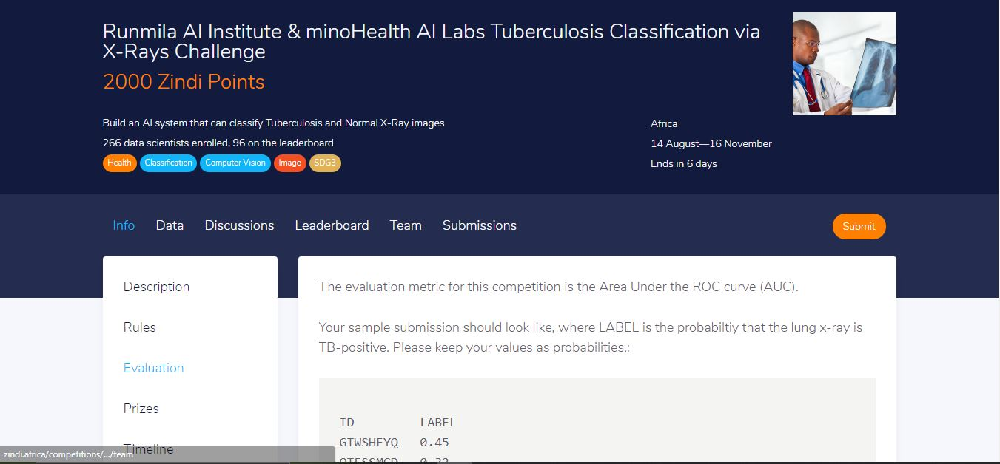

# Runmila AI Institute & minoHealth AI Labs Tuberculosis Classification via X-Rays Challenge

## Building  an AI system that can classify Tuberculosis and Normal X-Ray images

This is a challenge on https://zindi.africa/competitions/runmila-ai-institute-minohealth-ai-labs-tuberculosis-classification-via-x-rays-challenge 

Tuberculosis (TB) is the ninth leading cause of death worldwide. In 2016, an estimated 417,000 people died from Tuberculosis in Africa, and 1.7 million globally. In South Africa Tuberculosis is the leading cause of death with 450,000 people developing the disease every year and 89,000 people dying from it. That’s ten people every hour.

With over 800,000 confirmed cases and 18,000 deaths recorded in Africa and over 17 million confirmed cases and 670,000 recorded deaths globally as of August 2, 2020, the COVID-19 global pandemic continues to take a heavy toll around the world. In countries with a high prevalence level of TB, TB can create additional complexity to the COVID-19 response. And by the same token, COVID-19 is adding new complexity to the ongoing battle against TB.

For both TB and COVID-19 patients, medical imaging (Chest X-Rays and/or CT Scans) can sometimes be performed to identify and manage any chest abnormalities that may develop.

This challenge asks you to build an AI model that can classify Tuberculosis and Normal X-Ray results. With Tuberculosis infections still active as the COVID-19 pandemic continues, an automated tool to help identify TB has the potential to reduce hospital workload and optimize patient care during a time when hospitals are being overwhelmed by COVID-19 cases.

